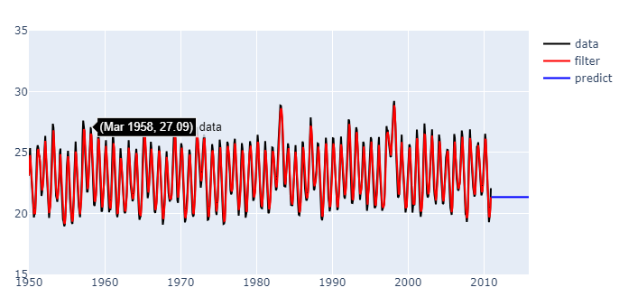
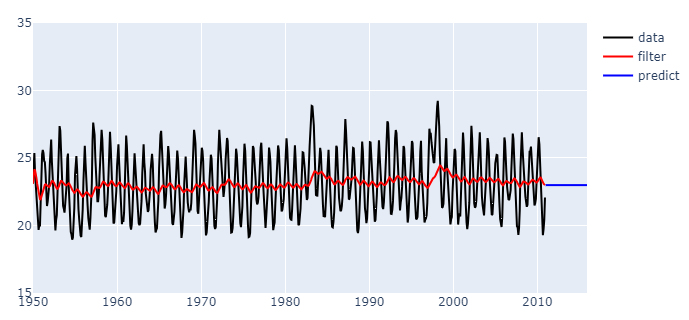
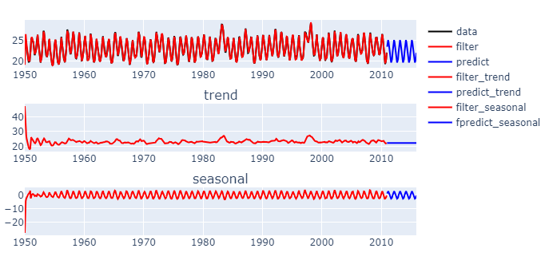
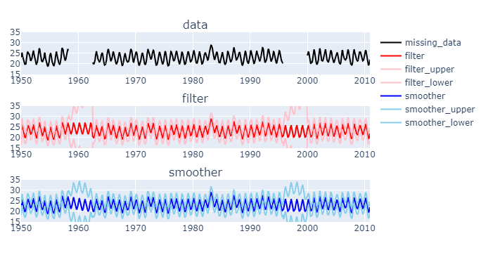
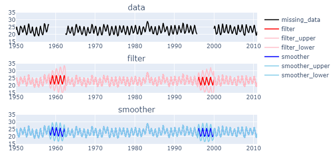

## 本記事の内容
part2では線形ガウス型状態空間モデルに対するカルマンフィルタをPythonで実装してみる。今回は勉強のため（できる限り）スクラッチ実装するが、statsmodelsに実装されているものを使ってもよさそう。

https://www.statsmodels.org/dev/statespace.html

## 使用するデータ
statsmodels.datasetsにあるエルニーニョデータを使用する。

https://www.statsmodels.org/stable/datasets/generated/elnino.html

```python
import numpy as np
import pandas as pd
import statsmodels.datasets

df = statsmodels.datasets.elnino.load().data
```

太平洋の海表面温度の月次データ（1950/1~2010/12）。
```shell
	YEAR	JAN	　　FEB　　	MAR　　	APR　	MAY　	JUN　	JUL　	AUG　	SEP　	OCT　	NOV　	DEC
0	1950.0	23.11	24.20	25.37	23.86	23.03	21.57	20.63	20.15	19.67	20.03	20.02	21.80
1	1951.0	24.19	25.28	25.60	25.37	24.79	24.69	23.86	22.32	21.44	21.77	22.33	22.89
2	1952.0	24.52	26.21	26.37	24.73	23.71	22.34	20.89	20.02	19.63	20.40	20.77	22.39
3	1953.0	24.15	26.34	27.36	27.03	25.47	23.49	22.20	21.45	21.25	20.95	21.60	22.44
4	1954.0	23.02	25.00	25.33	22.97	21.73	20.77	19.52	19.33	18.95	19.11	20.27	21.30
...	　...	　...	　...	　...	　...	　...	　...	　...	　...	　...	　...	　...	　...
56	2006.0	24.76	26.52	26.22	24.29	23.84	22.82	22.20	21.89	21.93	22.46	22.61	24.15
57	2007.0	25.82	26.81	26.41	24.96	23.05	21.61	21.05	19.95	19.85	19.31	19.82	21.15
58	2008.0	24.24	26.39	26.91	25.68	24.43	23.19	23.02	22.14	21.60	21.39	21.54	22.73
59	2009.0	24.39	25.53	25.48	25.84	24.95	24.09	23.09	22.03	21.48	21.64	21.99	23.21
60	2010.0	24.70	26.16	26.54	26.04	24.75	23.26	21.11	19.49	19.28	19.73	20.44	22.07
61 rows × 13 columns
```

2次元（年×月）になっているものを１次元に直して使いやすく整形する。カルマンフィルタによる欠測値処理も確認したいので、人工的に欠測させたデータも用意しておく。
```python
df = pd.DataFrame(
    index=pd.date_range(start="1950/01", end="2010/12", freq="MS"),
    columns=["Temperature"],
    data=df.drop("YEAR", axis=1).values.flatten()
)

df["Temperature_missing"] = df["Temperature"]
df["Temperature_missing"].iloc[100:150] = np.nan # 50か月欠損
df["Temperature_missing"].iloc[550:600] = np.nan # 50か月欠損
```

データをプロットしてみる。
```python
import plotly.graph_objects as go
from plotly.subplots import make_subplots

# プロット用の補助関数
def plot(request):
    traces = request["traces"]
    config = request["config"]

    fig = make_subplots(
        rows=config["rows"],
        cols=config["cols"],
        subplot_titles=config["titles"]
    )

    for trace_key in traces:
        fig.add_trace(
            go.Scatter(
                x=traces[trace_key]["x"],
                y=traces[trace_key]["y"],
                marker_color=traces[trace_key]["color"],
                name=trace_key,
                mode="lines",
                showlegend=traces[trace_key]["showlegend"]
            ),
            row=traces[trace_key]["row"],
            col=traces[trace_key]["col"]
        )

    fig.update_yaxes(range=[config["yaxis"]["min"], config["yaxis"]["max"]])
    fig.update_layout(showlegend=True)
    
    return fig

# プロット
config = {
    "yaxis": {"min": 15, "max": 35},
    "rows": 2,
    "cols": 1,
    "titles": ["original data", "missing data"]
}
traces = {
    "data": {
        "x": df.index,
        "y": df["Temperature"],
        "color": "black",
        "row": 1,
        "col": 1,
        "showlegend": False
    },
    "missing_data": {
        "x": df.index,
        "y": df["Temperature_missing"],
        "color": "black",
        "row": 2,
        "col": 1,
        "showlegend": False
    }
}
request = {"config": config, "traces": traces}
fig = plot(request)
fig.show()
```


## カルマンフィルタの実装
線形ガウス型状態空間モデル用のクラスを作ってみた。
```python
class LinearGaussianStateSpaceModel():
    """
    線形ガウス型状態空間モデル
    """
    def __init__(self, mu0, V0, F, G, H, Q, R, y):
        """
        [状態空間モデル]
        x_t = F_t * x_t-1 + G_t * v_t
        y_t = H_t * x_t + w_t
        x_0 ~ N(mu0, V0)
        v_t ~ N(0, Q_t)
        w_t ~ N(0, R_t)

        [引数]
        mu0: ndarray(k, 1)       （次元に注意）
        V0 : ndarray(k, k)
        F:   ndarray(T, k, k)
        G:   ndarray(T, k, m)
        H:   ndarray(T, l, k)
        Q:   ndarray(T, m, m)
        R:   ndarray(T, l, l)
        y:   ndarray(T, l, 1)    （欠測値はnp.nan, 次元に注意）
        """
        # メンバ変数に保存
        self.mu0 = mu0
        self.V0 = V0
        self.F = F
        self.G = G
        self.H = H
        self.Q = Q
        self.R = R
        self.y = y

        # 各次元
        self.dim_k = F.shape[1]
        self.dim_m = G.shape[2]
        self.dim_l = H.shape[1]

        # 学習期間
        self.T = y.shape[0]

        # 次元のチェック
        self._check_dimension()

    def set_params(
        self,
        mu0=None,
        V0=None,
        F=None,
        G=None,
        H=None,
        Q=None,
        R=None,
        y=None
    ):
        """
        パラメータを設定する（更新する）
        """
        self.mu0 = mu0 if mu0 is not None else self.mu0
        self.V0 = V0 if V0 is not None else self.V0
        self.F = F if F is not None else self.F
        self.G = G if G is not None else self.G
        self.H = H if H is not None else self.H
        self.Q = Q if Q is not None else self.Q
        self.R = R if R is not None else self.R
        self.y = y if y is not None else self.y

        # 次元のチェック
        self._check_dimension()

    def kalman_filter(self, calc_liklihood=False):
        """
        カルマンフィルタを実行する
        """
        # 計算結果格納用（x~N(mu, V), y~N(nu, D)）
        mu_predicted = np.zeros((self.T, self.dim_k, 1))
        V_predicted  = np.zeros((self.T, self.dim_k, self.dim_k))
        mu_filtered = np.zeros((self.T, self.dim_k, 1))
        V_filtered  = np.zeros((self.T, self.dim_k, self.dim_k))
        nu_predicted = np.zeros((self.T, self.dim_l, 1))
        D_predicted = np.zeros((self.T, self.dim_l, self.dim_l))

        if calc_liklihood:
            ll = 0 # 対数尤度

        # カルマンフィルタを実行
        for t in range(self.T):
            # 一期先予測
            if t == 0:
                mu_predicted[0], V_predicted[0] = self._calc_x_predicted(
                    self.mu0,
                    self.V0,
                    self.F[0],
                    self.G[0],
                    self.Q[0]
                )
            else:
                mu_predicted[t], V_predicted[t] = self._calc_x_predicted(
                    mu_filtered[t-1],
                    V_filtered[t-1],
                    self.F[t],
                    self.G[t],
                    self.Q[t]
                )
            # フィルタ
            mu_filtered[t], V_filtered[t] = self._calc_x_filtered(
                mu_predicted[t],
                V_predicted[t],
                self.F[t],
                self.H[t],
                self.R[t],
                self.y[t]
            )
            # yの予測
            nu_predicted[t], D_predicted[t] = self._calc_y_predicted(
                mu_filtered[t],
                V_filtered[t],
                self.H[t],
                self.R[t]   
            )
            
            if calc_liklihood:
                ll += self._loglikelihood(
                    nu_predicted[t],
                    D_predicted[t],
                    self.y[t]
                )

        result = {
            "mu_predicted": mu_predicted,
            "V_predicted": V_predicted,
            "mu_filtered": mu_filtered,
            "V_filtered": V_filtered,
            "nu_predicted": nu_predicted,
            "D_predicted": D_predicted,
            "logliklihood": ll if calc_liklihood else None
        }
        return result
    
    def kalman_smoother(self):
        """
        固定区間平滑化を実行する
        """
        # 計算結果格納用（x~N(mu, V), y~N(nu, D)）
        mu_smoothed = np.zeros((self.T, self.dim_k, 1))
        V_smoothed  = np.zeros((self.T, self.dim_k, self.dim_k))
        nu_predicted = np.zeros((self.T, self.dim_l, 1))
        D_predicted = np.zeros((self.T, self.dim_l, self.dim_l))

        # カルマンフィルタを実行
        filter_result = self.kalman_filter()
        mu_predicted = filter_result["mu_predicted"]
        V_predicted = filter_result["V_predicted"]
        mu_filtered = filter_result["mu_filtered"]
        V_filtered = filter_result["V_filtered"]

        # 固定区間平滑化を実行
        for t in reversed(range(self.T)):
            # 固定区間平滑化
            if t == self.T-1:
                mu_smoothed[-1] = mu_filtered[-1]
                V_smoothed[-1] = V_filtered[-1]
            else:
                A = V_filtered[t] @ self.F[t+1].T @ np.linalg.inv(V_predicted[t+1])
                mu_smoothed[t] = mu_filtered[t] + A @ (mu_smoothed[t+1] - mu_predicted[t+1])
                V_smoothed[t] = V_filtered[t] + A @ (V_smoothed[t+1] - V_predicted[t+1]) @ A.T
            # yの予測
            nu_predicted[t], D_predicted[t] = self._calc_y_predicted(
                mu_smoothed[t],
                V_smoothed[t],
                self.H[t],
                self.R[t]   
            )
        # 初期状態も平滑化する
        A = self.V0 @ self.F[0].T @ np.linalg.inv(V_predicted[0])
        mu0_smoothed = self.mu0 + A @ (mu_smoothed[0] - mu_predicted[0])
        V0_smoothed = self.V0 + A @ (V_smoothed[0] - V_predicted[0]) @ A.T      

        result = {
            "mu_predicted": mu_predicted,
            "V_predicted": V_predicted,
            "mu_filtered": mu_filtered,
            "V_filtered": V_filtered,
            "mu0_smoothed": mu0_smoothed,
            "V0_smoothed": V0_smoothed,
            "mu_smoothed": mu_smoothed,
            "V_smoothed": V_smoothed,
            "nu_predicted": nu_predicted,
            "D_predicted": D_predicted
        }
        return result
    
    def kalman_predictor(self, F, G, H, Q, R):
        """
        長期予測を行う
        """
        # 予測時点数
        horizon = F.shape[0]

        # 計算結果格納用（x~N(mu, V), y~N(nu, D)）
        mu_predicted = np.zeros((horizon, self.dim_k, 1))
        V_predicted  = np.zeros((horizon, self.dim_k, self.dim_k))
        nu_predicted = np.zeros((horizon, self.dim_l, 1))
        D_predicted  = np.zeros((horizon, self.dim_l, self.dim_l))

        # カルマンフィルタを実行
        filter_result = self.kalman_filter()
        mu_filtered = filter_result["mu_filtered"]
        V_filtered = filter_result["V_filtered"]

        # 将来予測を実行
        for t in range(horizon):
            if t == 0:
                # 1期先予測（観測値がないので予測分布=フィルタ分布）
                mu_predicted[0], V_predicted[0] = self._calc_x_predicted(
                    mu_filtered[-1],
                    V_filtered[-1],
                    F[0],
                    G[0],
                    Q[0]
                )
                # yの予測
                nu_predicted[0], D_predicted[0] = self._calc_y_predicted(
                    mu_predicted[0],
                    V_predicted[0],
                    H[0],
                    R[0]
                )
            else:
                mu_predicted[t], V_predicted[t] = self._calc_x_predicted(
                    mu_predicted[t-1],
                    V_predicted[t-1],
                    F[t],
                    G[t],
                    Q[t]
                )
                nu_predicted[t], D_predicted[t] = self._calc_y_predicted(
                    mu_predicted[t],
                    V_predicted[t],
                    H[t],
                    R[t]
                )

        result = {
            "mu_predicted": mu_predicted,
            "V_predicted": V_predicted,
            "nu_predicted": nu_predicted,
            "D_predicted": D_predicted
        }
        return result
    
    def _check_dimension(self):
        """
        与えられたパラメータの次元をチェックする
        """
        assert self.F.shape[0] == self.T, f"{self.F.shape[0]} != {self.T}"
        assert self.G.shape[0] == self.T, f"{self.G.shape[0]} != {self.T}"
        assert self.H.shape[0] == self.T, f"{self.H.shape[0]} != {self.T}"
        assert self.Q.shape[0] == self.T, f"{self.Q.shape[0]} != {self.T}"
        assert self.R.shape[0] == self.T, f"{self.R.shape[0]} != {self.T}"
        assert self.y.shape[0] == self.T, f"{self.y.shape[0]} != {self.T}"

        assert self.F.shape[1] == self.dim_k, f"{self.F.shape[1]} != {self.dim_k}"
        assert self.F.shape[2] == self.dim_k, f"{self.F.shape[2]} != {self.dim_k}"
        assert self.G.shape[1] == self.dim_k, f"{self.G.shape[1]} != {self.dim_k}"
        assert self.G.shape[2] == self.dim_m, f"{self.G.shape[2]} != {self.dim_m}"
        assert self.H.shape[1] == self.dim_l, f"{self.H.shape[1]} != {self.dim_l}"
        assert self.H.shape[2] == self.dim_k, f"{self.H.shape[2]} != {self.dim_k}"
        assert self.Q.shape[1] == self.dim_m, f"{self.Q.shape[1]} != {self.dim_m}"
        assert self.Q.shape[2] == self.dim_m, f"{self.Q.shape[2]} != {self.dim_m}"
        assert self.R.shape[1] == self.dim_l, f"{self.R.shape[1]} != {self.dim_l}"
        assert self.R.shape[2] == self.dim_l, f"{self.R.shape[2]} != {self.dim_l}"
        assert self.y.shape[1] == self.dim_l, f"{self.y.shape[1]} != {self.dim_l}"
        assert self.y.shape[2] == 1, f"{self.y.shape[2]} != {1}"

        assert self.mu0.shape[0] == self.dim_k, f"{self.mu0.shape[0]} != {self.dim_k}"
        assert self.mu0.shape[1] == 1, f"{self.mu0.shape[2]} != {1}"
        assert self.V0.shape[0] == self.dim_k, f"{self.V0.shape[0]} != {self.dim_k}"
        assert self.V0.shape[1] == self.dim_k, f"{self.V0.shape[1]} != {self.dim_k}"

    def _calc_x_predicted(self, mu0, V0, F, G, Q):
        """
        1時点先の予測分布を求める

        mu0: ndarray(k, 1)
        V0 : ndarray(k, k)
        F  : ndarray(k, k)
        G  : ndarray(k, m)
        Q  : ndarray(m, m)

        return x_predicted ~ N(mu_predicted, V_predicted)
        """
        # 1期先予測
        mu_predicted = F @ mu0
        V_predicted = F @ V0 @ F.T + G @ Q @ G.T

        return mu_predicted, V_predicted
    
    def _calc_x_filtered(self, mu_predicted, V_predicted, F, H, R, y=None):
        """
        1時点先のフィルタ分布を求める

        mu_predict: ndarray(k, 1)
        V_predict : ndarray(k, k)
        F         : ndarray(k, k)
        H         : ndarray(l, k)
        R         : ndarray(l, l)
        y         : ndarray(l, 1)

        return x_filtered ~ N(mu_filtered, V_filtered)
        """
        # フィルタ（観測値がある場合）
        if not np.isnan(y):
            # 逆行列計算の高速化は今はしない
            I = np.identity(F.shape[0])
            K = V_predicted @ H.T @ np.linalg.inv(H @ V_predicted @ H.T + R)
            mu_filtered = mu_predicted + K @ (y - H @ mu_predicted)
            V_filtered = (I - K @ H) @ V_predicted

        # フィルタ（欠測の場合）
        else:
            mu_filtered = mu_predicted
            V_filtered = V_predicted

        return mu_filtered, V_filtered

    def _calc_y_predicted(self, mu_filtered, V_filtered, H, R):
        """
        観測値の予測分布を計算する

        y = H * x + w
        x ~ N(mu, V)
        y ~ N(nu, D)
        w ~ N(0, R)

        nu : ndarray(l, 1)
        D  : ndarray(l, l)

        return y ~ N(nu, D)
        """
        nu = H @ mu_filtered
        D = H @ V_filtered @ H.T + R

        return nu, D

    def _loglikelihood(self, nu, D, y):
        """
        対数尤度を求める

        return delta_ll
        """
        if not np.isnan(y):
            delta_ll = self.dim_l * np.log(2*np.pi)
            delta_ll += np.log(np.linalg.det(D))
            delta_ll += ((y-nu).T @ np.linalg.inv(D) @ (y-nu)).item()
            delta_ll *= -0.5
        else:
            delta_ll = 0

        return delta_ll

```
## 計算
### ランダムウォークモデル
まずは簡単な1次のトレンドモデル（ランダムウォークモデル）から実装してみる。状態モデル$(2)$は局所的には$x_t$が一定（定数関数）であることを示しているが、状態ノイズ$v_t$の効果によって大局的には複雑なトレンドを表現できる。

**[1次のトレンドモデル]**

$$
\begin{align}
y_t &= x_{t} + w_t, \tag{1} \\
x_t &= x_{t-1} + v_t, \tag{2} \\
x_0 &= N(\mu_0, V_0), \tag{3}\\
v_t &= N(0, Q_t), \tag{4}\\
w_t &= N(0, R_t), \tag{5}
\end{align} 
$$

このとき、状態空間モデルを構成する各行列は次のようになる。

$$
\begin{align}
F_t &= 
\begin{bmatrix}
1
\end{bmatrix},
\quad
G_t = 
\begin{bmatrix}
1
\end{bmatrix},
\quad
H_t = 
\begin{bmatrix}
1
\end{bmatrix},
\quad
Q_t = 
\begin{bmatrix}
\tau^2
\end{bmatrix},
\quad
R_t = 
\begin{bmatrix}
\sigma^2
\end{bmatrix},
\tag{6}
\end{align}
$$

### ランダムウォークモデルの実装と考察
欠損のないデータに対してランダムウォークモデルを使ったフィルタ・予測を試してみる。お試しなので、ハイパーパラメータの$\mu_0, V_0, \tau^2, \sigma^2$は適当に決めた。
```python
# ランダムウォークモデル
# データの長さ
T = len(df)

# 状態方程式の行列
F0 = np.array([[1]])
              
# システムノイズの行列
G0 = np.array([[1]])

# 観測方程式の行列
H0 = np.array([[1]])

# システムノイズの分散共分散行列
Q0 = np.array([[1]])

# 観測ノイズの分散共分散行列
R0 = np.array([[1]])

# 初期状態（データの平均・分散で適当に決定）
mu0 = np.array([[df["Temperature"].mean()]])
V0 = np.array([[df["Temperature"].var()]])

# スタック
def stack_matrix(M0, N):
    """
    ndarray Mを0軸にN個重ねた ndarrayを作成する
    """
    M = np.zeros((N, M0.shape[0], M0.shape[1]))
    for n in range(N):
        M[n] = M0

    return M

# 各行列はt=1,..,Tで不変
F = stack_matrix(F0, T)
G = stack_matrix(G0, T)
H = stack_matrix(H0, T)
Q = stack_matrix(Q0, T)
R = stack_matrix(R0, T)

# 観測値（T×1×1行列とすることに注意）
y = np.expand_dims(df["Temperature_missing"].values, (1, 2))

# モデル作成
model = LinearGaussianStateSpaceModel(mu0, V0, F, G, H, Q, R, y)

# カルマンフィルタ実行
filter_result = model.kalman_filter()

# 長期予測（5年分） 実行
horizon = 12*5
Fp = stack_matrix(F0, horizon)
Gp = stack_matrix(G0, horizon)
Hp = stack_matrix(H0, horizon)
Qp = stack_matrix(Q0, horizon)
Rp = stack_matrix(R0, horizon)
predictor_result = model.kalman_predictor(Fp, Gp, Hp, Qp, Rp)

# プロット
config = {
    "yaxis": {"min": 15, "max": 35},
    "rows": 1,
    "cols": 1,
    "titles": [None]
}
traces = {
    "data": {
        "x": df.index,
        "y": df["Temperature"],
        "color": "black",
        "row": 1,
        "col": 1,
        "showlegend": True
    },
    "filter": {
        "x": df.index,
        "y": filter_result["mu_filtered"][:,0,0],
        "color": "red",
        "row": 1,
        "col": 1,
        "showlegend": True
    },
    "predict": {
        "x": pred_index,
        "y": predictor_result["mu_predicted"][:,0,0],
        "color": "blue",
        "row": 1,
        "col": 1,
        "showlegend": True
    }
}

request = {"config": config, "traces": traces}
fig = plot(request)
fig.show()
```

学習期間の部分だけ見るときれいにフィッティングしているようにも見えるが、実際は観測値をただなぞっているだけである。状態は一定としているため、予測値は学習期間の最終状態のまま推移する。



次はシステムノイズの分散を$10^{-3}$に変えて計算してみる。
```python
# システムノイズを小さくした場合
Q0 = np.array([[1e-3]])
Q = stack_matrix(Q0, T)
model.set_params(Q=Q)

filter_result = model.kalman_filter()
predictor_result = model.kalman_predictor(Fp, Gp, Hp, Qp, Rp)
```



システムノイズ<観測ノイズとすると、カルマンフィルタは観測値より状態モデルを信用する。そのため、状態モデル（状態＝一定）を強く反映した結果が得られた。実は、トレンドモデルの推定値を決定するのはシステムノイズと観測ノイズの分散比$\lambda=\tau^2/\sigma^2$であり、トレードオフパラメータと呼ばれる。

### 季節調整モデル
ランダムウォークモデルではデータをうまく表現することはできなさそうだった。今回扱っているデータは海表面温度の推移であることを思い出すと、1年周期（12か月周期）の周期性があることが予想される。そこで、この周期性の効果を取り入れた季節調整モデルを実装してみる。

**[季節調整モデル]**

$$
\begin{align}
y_t &= t_t + s_t + w_t, \tag{7} \\
t_t &= t_{t-1} + v^{(t)}_t, \tag{8} \\
s_t &= -\sum_{i=1}^{11}s_{t-i} + v^{(s)}_t, \tag{9}\\
x_t &= \begin{bmatrix}
t_t & s_t & s_{t-1} & \cdots & s_{t-11}
\end{bmatrix}^T, \tag{10}\\
x_0 &= N(\mu_0, V_0), \tag{11}\\
v_t^{(t)} &= N(0, Q^{(t)}_t), \tag{12}\\
v_t^{(s)} &= N(0, Q^{(s)}_t), \tag{13}\\
w_t &= N(0, R_t), \tag{14}
\end{align} 
$$

これは、$y_t$をトレンド成分$t_t$と季節周期成分$s_t$に分解したモデルになっている。トレンド成分は$(8)$のランダムウォークモデルに従うと仮定している。新たに加えた季節周期成分の従う状態モデル$(9)$は一見わかりにくいが、$\sum_{i=0}^{11}s_i\simeq 0$と変形すると連続した12個の$s_t$の和が（ほぼ）0で一定であることを示しており、これが周期性を表すこととなる[^1]。トレンド成分$t_t$と周期成分モデルで使用される$s_t, \cdots, s_{t-11}$が状態ベクトル$(10)$となる。

このとき、状態空間モデルを構成する各行列は次のようになる。

$$
\begin{align}
F_t &= 
\begin{bmatrix}
F_t^{(t)} & \\
& F_t^{(s)}
\end{bmatrix},
\quad
F_t^{(t)} = 
\begin{bmatrix}
1
\end{bmatrix},
\quad
F_t^{(s)} = 
\begin{bmatrix}
-1 & -1 & \cdots & -1  \\
1 & & & \\
& \ddots & & \\
& & 1 & 
\end{bmatrix}, \tag{15}\\
G_t &= 
\begin{bmatrix}
G_t^{(t)} & \\
& G_t^{(s)}
\end{bmatrix},
\quad
G_t^{(t)} = 
\begin{bmatrix}
1
\end{bmatrix},
\quad
G_t^{(s)} = 
\begin{bmatrix}
1 \\
0 \\
\vdots \\
0
\end{bmatrix}, \tag{16}\\
H_t &= 
\begin{bmatrix}
H_t^{(t)} & H_t^{(s)}
\end{bmatrix},
\quad
H_t^{(t)} = 
\begin{bmatrix}
1
\end{bmatrix},
\quad
H_t^{(s)} = 
\begin{bmatrix}
1 & 0 & \cdots & 0
\end{bmatrix}, \tag{17}\\
Q_t &= 
\begin{bmatrix}
Q_t^{(t)} & \\
& Q_t^{(s)}
\end{bmatrix},
\quad
Q_t^{(t)} = 
\begin{bmatrix}
{\tau^{2}}^{(t)}
\end{bmatrix},
\quad
Q_t^{(s)} = 
\begin{bmatrix}
{\tau^{2}}^{(s)}
\end{bmatrix}, \tag{18}\\
R_t &= 
\begin{bmatrix}
\sigma^2
\end{bmatrix}, \tag{19}\\
\end{align}
$$

### 季節調整モデルの実装と考察
欠損のないデータに対して季節調整モデルを使ったフィルタ・予測を実装してみた。今回も、ハイパーパラメータの$\mu_0, V_0, {\tau^{2}}^{(t)}, {\tau^{2}}^{(s)}, \sigma^2$は適当に決めた。

```python
# 季節調整モデル
# 補助関数
def make_diag_stack_matrix(matrix_list):
    """
    行列のリストから対角方向に結合した行列を作成する
    """
    dim_i = sum([m.shape[0] for m in matrix_list])
    dim_j = sum([m.shape[1] for m in matrix_list])
    block_diag = np.zeros((dim_i, dim_j))

    pos_i = pos_j = 0
    for m in matrix_list:
        for i in range(m.shape[0]):
            for j in range(m.shape[1]):
                block_diag[pos_i+i, pos_j+j] = m[i, j]
        pos_i += m.shape[0]
        pos_j += m.shape[1]

    return block_diag

def make_hstack_matrix(matrix_list):
    """
    行列のリストから横方向に結合した行列を作成する
    """
    return np.concatenate(matrix_list, 1)

# 状態方程式の行列
F0_trend = np.array(
    [[1]]
)
F0_seasonal = np.array(
    [[-1, -1, -1, -1, -1, -1, -1, -1, -1, -1, -1],
     [ 1,  0,  0,  0,  0,  0,  0,  0,  0,  0,  0],
     [ 0,  1,  0,  0,  0,  0,  0,  0,  0,  0,  0],
     [ 0,  0,  1,  0,  0,  0,  0,  0,  0,  0,  0],
     [ 0,  0,  0,  1,  0,  0,  0,  0,  0,  0,  0],
     [ 0,  0,  0,  0,  1,  0,  0,  0,  0,  0,  0],
     [ 0,  0,  0,  0,  0,  1,  0,  0,  0,  0,  0],
     [ 0,  0,  0,  0,  0,  0,  1,  0,  0,  0,  0],
     [ 0,  0,  0,  0,  0,  0,  0,  1,  0,  0,  0],
     [ 0,  0,  0,  0,  0,  0,  0,  0,  1,  0,  0],
     [ 0,  0,  0,  0,  0,  0,  0,  0,  0,  1,  0]]
)
F0 = make_diag_stack_matrix([F0_trend, F0_seasonal])

# システムノイズの行列
G0_trend = np.array(
    [[1]]
)
G0_seasonal = np.array(
    [[1],
     [0],
     [0],
     [0],
     [0],
     [0],
     [0],
     [0],
     [0],
     [0],
     [0]]
)
G0 = make_diag_stack_matrix([G0_trend, G0_seasonal])

# 観測方程式の行列
H0_trend = np.array([[1]])
H0_seasonal = np.array([[1, 0, 0, 0, 0, 0, 0, 0, 0, 0, 0]])
H0 = make_hstack_matrix([H0_trend, H0_seasonal])

# システムノイズの分散共分散行列
Q0_trend = np.array([[1]])
Q0_seasonal = np.array([[1]])
Q0 = make_diag_stack_matrix([Q0_trend, Q0_seasonal])

# 観測ノイズの分散共分散行列
R0 = np.array([[1]])

# スタック
F = stack_matrix(F0, T)
G = stack_matrix(G0, T)
H = stack_matrix(H0, T)
Q = stack_matrix(Q0, T)
R = stack_matrix(R0, T)

# 初期状態（データの平均・分散で適当に決定）
mu0 = np.array([[df["Temperature"].mean() for i in range(F0.shape[0])]]).T
V0 = np.eye(F0.shape[0]) * df["Temperature"].var()

# 観測値（T×1×1行列とすることに注意）
y = np.expand_dims(df["Temperature"].values, (1, 2))

# モデル作成
model = LinearGaussianStateSpaceModel(mu0, V0, F, G, H, Q, R, y)

# カルマンフィルタ
filter_result = model.kalman_filter()

# 長期予測
horizon = 12*5
pred_index = pd.date_range(start=df.index[-1], periods=horizon+1, freq="MS")[1:]
Fp = stack_matrix(F0, horizon)
Gp = stack_matrix(G0, horizon)
Hp = stack_matrix(H0, horizon)
Qp = stack_matrix(Q0, horizon)
Rp = stack_matrix(R0, horizon)
predictor_result = model.kalman_predictor(Fp, Gp, Hp, Qp, Rp)

# プロット
config = {
    "yaxis": {"min": None, "max": None},
    "rows": 3,
    "cols": 1,
    "titles": [None, "trend", "seasonal"]
}
traces = {
    "data": {
        "x": df.index,
        "y": df["Temperature"],
        "color": "black",
        "row": 1,
        "col": 1,
        "showlegend": True
    },
    "filter": {
        "x": df.index,
        "y": filter_result["nu_predicted"][:,0,0],
        "color": "red",
        "row": 1,
        "col": 1,
        "showlegend": True
    },
    "predict": {
        "x": pred_index,
        "y": predictor_result["nu_predicted"][:,0,0],
        "color": "blue",
        "row": 1,
        "col": 1,
        "showlegend": True
    },
    "filter_trend": {
        "x": df.index,
        "y": filter_result["mu_filtered"][:,0,0],
        "color": "red",
        "row": 2,
        "col": 1,
        "showlegend": True
    },
    "predict_trend": {
        "x": pred_index,
        "y": predictor_result["mu_predicted"][:,0,0],
        "color": "blue",
        "row": 2,
        "col": 1,
        "showlegend": True
    },
    "filter_seasonal": {
        "x": df.index,
        "y": filter_result["mu_filtered"][:,1,0],
        "color": "red",
        "row": 3,
        "col": 1,
        "showlegend": True
    },
    "predict_seasonal": {
        "x": pred_index,
        "y": predictor_result["mu_predicted"][:,1,0],
        "color": "blue",
        "row": 3,
        "col": 1,
        "showlegend": True
    }
}

request = {"config": config, "traces": traces}
fig = plot(request)
fig.show()
```


狙い通りにトレンド成分と周期成分へと分解できており、予測も悪くない結果となった。

### 欠測データに対する平滑化の実装と考察
季節調整モデルを使って欠測データの補間を試してみる。

```python
# 欠測値の補間
# 欠測値のセット
y = np.expand_dims(df["Temperature_missing"].values, (1, 2))
model.set_params(y=y)

# カルマンフィルタ実行（比較用）
filter_result = model.kalman_filter()
# 固定区間平滑化実行
smoother_result = model.kalman_smoother()

# プロット
config = {
    "yaxis": {"min": 15, "max": 35},
    "rows": 3,
    "cols": 1,
    "titles": ["data", "filter", "smoother"]
}
traces = {
    "missing_data": {
        "x": df.index,
        "y": df["Temperature_missing"],
        "color": "black",
        "row": 1,
        "col": 1,
        "showlegend": True
    },
    "filter": {
        "x": df.index,
        "y": filter_result["nu_predicted"][:,0,0],
        "color": "red",
        "row": 2,
        "col": 1,
        "showlegend": True
    },
    "filter_upper": {
        "x": df.index,
        "y": filter_result["nu_predicted"][:,0,0] \
            + 2 * np.sqrt(filter_result["D_predicted"][:,0,0]),
        "color": "pink",
        "row": 2,
        "col": 1,
        "showlegend": True
    },
    "filter_lower": {
        "x": df.index,
        "y": filter_result["nu_predicted"][:,0,0] \
            - 2 * np.sqrt(filter_result["D_predicted"][:,0,0]),
        "color": "pink",
        "row": 2,
        "col": 1,
        "showlegend": True
    },
    "smoother": {
        "x": df.index,
        "y": smoother_result["nu_predicted"][:,0,0],
        "color": "blue",
        "row": 3,
        "col": 1,
        "showlegend": True
    },
    "smoother_upper": {
        "x": df.index,
        "y": smoother_result["nu_predicted"][:,0,0] \
            + 2 *np.sqrt(smoother_result["D_predicted"][:,0,0]),
        "color": "skyblue",
        "row": 3,
        "col": 1,
        "showlegend": True
    },
    "smoother_lower": {
        "x": df.index,
        "y": smoother_result["nu_predicted"][:,0,0] \
            - 2 *np.sqrt(smoother_result["D_predicted"][:,0,0]),
        "color": "skyblue",
        "row": 3,
        "col": 1,
        "showlegend": True
    },
}

request = {"config": config, "traces": traces}
fig = plot(request)
fig.show()
```



赤線がカルマンフィルタによる補間、青線が固定区間平滑化による補間である。前者は欠測時刻より過去の情報をもとに補間しているのに対し、後者はデータが存在する全期間の情報を使っているため、固定区間平滑化のほうが滑らかな補間になっている。薄い赤/青で示した信頼区間（$\pm 2\sigma$）を見ると、平滑化は前後の情報を使うことで信頼区間の狭い予測ができていることが視覚的にわかる。

### 最尤法によるパラメータ推定
最後に、先ほどまでは適当な値としていたハイパーパラメータ$\mu_0, V_0, {\tau^{2}}^{(t)}, {\tau^{2}}^{(s)}, \sigma^2$の推定を試してみる。パラメータ数が多くなってしまうのを防ぐため、初期状態は$\mu_0=a\times[1, \cdots, 1]^T,\ V_0=bI$の形を仮定した。数値最適化にはscipyに実装されているL-BFGS-B法を用いた。

```python
# 目的関数（対数尤度×(-1)）
def objective(params):
    # 初期状態
    mu0 = np.array([[params[0] for _ in range(F0.shape[0])]]).T
    V0 = np.eye(F0.shape[0]) * params[1]

    # システムノイズの分散共分散行列
    Q0_trend = np.array([[params[2]]])
    Q0_seasonal = np.array([[params[3]]])
    Q0 = make_diag_stack_matrix([Q0_trend, Q0_seasonal])
    Q = stack_matrix(Q0, T)
    
    # 観測ノイズの分散共分散行列
    R0 = np.array([[params[4]]])
    R = stack_matrix(R0, T)

    # パラメータ更新
    model.set_params(mu0=mu0, V0=V0, Q=Q, R=R)

    # カルマンフィルタを実行
    result = model.kalman_filter(calc_liklihood=True)

    return -1 * result["logliklihood"] # llの最大化＝-llの最小化

# パラメータ最適化
from scipy.optimize import minimize

# 初期値が悪いと収束しない（今後の課題）
optimization_result = minimize(
    fun=objective,
    x0=[0, 1, 1, 1, 1],
    bounds=[(None, None), (1e-5, None), (1e-5, None), (1e-5, None), (1e-5, None)], 
    method="L-BFGS-B"
)

# 最適パラメータで計算
params = optimization_result.x

# 初期状態
mu0 = np.array([[params[0] for _ in range(F0.shape[0])]]).T
V0 = np.eye(F0.shape[0]) * params[1]

# システムノイズの分散共分散行列
Q0_trend = np.array([[params[2]]])
Q0_seasonal = np.array([[params[3]]])
Q0 = make_diag_stack_matrix([Q0_trend, Q0_seasonal])
Q = stack_matrix(Q0, T)

# 観測ノイズの分散共分散行列（1×1行列とすることに注意）
R0 = np.array([[params[4]]])
R = stack_matrix(R0, T)

# パラメータ更新
model.set_params(mu0=mu0, V0=V0, Q=Q, R=R)

# カルマンフィルタを実行
filter_result = model.kalman_filter(calc_liklihood=True)
smoother_result = model.kalman_smoother()
```



先ほどの結果と比べて全体的に信頼区間が狭くなった。観測値があるところでは、期待値と信頼区間がほとんど重なってしまっている。平滑化における欠測値の補間はかなり良い感じに見える。

なお、パラメータ推定結果は

$$
\begin{align}
\mu_0 &= [0.68, \cdots, 0.68]^T, \\
V_0 &= 5.00I, \\
{\tau^{2}}^{(t)} &= 0.15, \\
{\tau^{2}}^{(s)} &= 0.53, \\
\sigma^2 &= 1.00\times 10^{-5},
\end{align}
$$

となっており、システムノイズに比べて観測ノイズがかなり小さく推定されている（観測ノイズはパラメータ探索範囲の下限値）。

## まとめ
本記事ではカルマンフィルタのpython実装とエルニーニョデータに対する試計算を行った。ランダムウォークモデルと季節調整モデルを実装し、フィルタや予測の様子を確認した。また、人工的に欠測させたデータを用意して、季節調整モデルで補間できることも確認した。最後に、対数尤度の最適化（最尤推定）によって、モデルのハイパーパラメータ推定も行い、最適化によってより優れた結果が得られることが分かった。次回以降は線形ガウス型の枠組みを外れて、非線形や非ガウス型の問題にチャレンジしてみる予定である。

## 参考文献
- 北川源四郎「Rによる時系列モデリング入門」

[^1]: 周期$p$の周期性を表現した式として自然なのは$s_t\simeq s_{t-p}$であるが、このままでは上手くいかないことが知られている。この表現の季節周期成分は、トレンド成分モデル$t_t\simeq t_{t-1}$と共通の因子を持ち、分解の一意性が失われるからである。時間シフトオペレーター$B$を$Bs_t \equiv s_{t-1}$と定義する。これを用いると季節周期成分モデル$s_t\simeq s_{t-p}$は$(1-B^p)s_t \simeq0$、トレンド成分モデルは$(1-B)t_t\simeq0$となり、$(1-B^p)=(1-B)(1+B+\cdots +B^{p-1})$であるから確かに共通因子$(1-B)$が含まれることがわかる。式$(9)$はこの共通因子を取り除いた$(1+B+\cdots +B^{p-1})s_t\simeq 0$に相当する。
